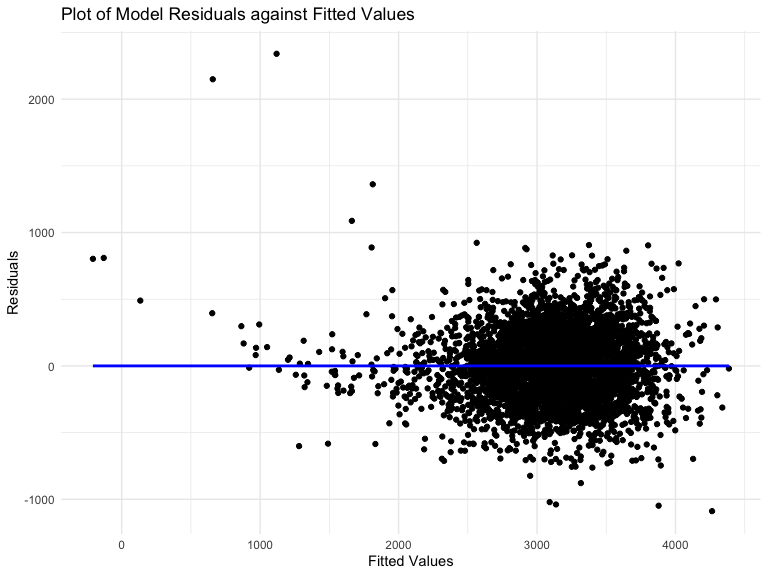
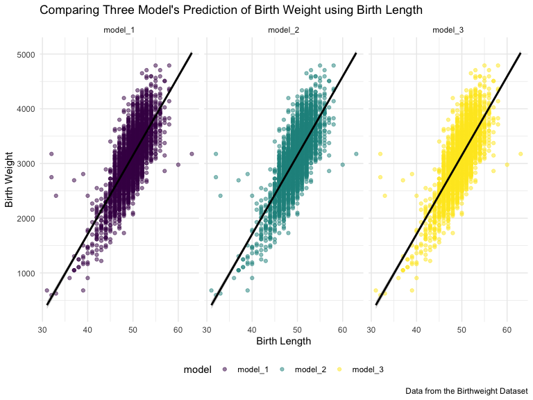

Homework 6
================
Kodiak Soled
11/19/2019

``` r
library(tidyverse) 
library(viridis)
library(modelr)
library(mgcv)

knitr::opts_chunk$set(
    echo = TRUE,
    warning = FALSE,
    fig.width = 8, 
  fig.height = 6,
  out.width = "90%"
)

options(
  ggplot2.continuous.colour = "viridis",
  ggplot2.continuous.fill = "viridis"
)

scale_colour_discrete = scale_colour_viridis_d

scale_fill_discrete = scale_fill_viridis_d

theme_set(theme_minimal() + theme(legend.position = "bottom"))
```

## Problem 1

#### Data Import & Cleaning

Loading in the Birthweight Dataset and cleaning the data including:

  - reading in the csv file (`read_csv`)
  - cleaning names (`janitor::clean_names`)
  - mutating catagorical variables that are numeric to factor variables
    (`as.factor`)
  - rounding numeric variables to the second decimal place

<!-- end list -->

``` r
birthweight =
  read_csv("./data/birthweight.csv") %>%
  janitor::clean_names() %>%
  mutate(
    babysex = as.factor(babysex),
    frace = as.factor(frace),
    mrace = as.factor(mrace),
    malform = as.factor(malform)
  ) %>%
  mutate_if(is.numeric, round, 2)
```

#### Proposed Model

Creating a proposed regression model using 13 out of the 20 predictors:
babysex, bhead, blength, delwt, fincome, gaweeks, malform, menarche,
mheight, momage, mrace, ppbmi, smoken.

``` r
model_1 = 
  lm(bwt ~ babysex + bhead + blength + delwt + fincome + gaweeks + malform + menarche + mheight + momage + mrace + ppbmi + smoken, data = birthweight) 

model_1 %>% 
  broom::glance() %>%
  knitr::kable(caption = "Regression Model 1 Summary")
```

| r.squared | adj.r.squared |    sigma | statistic | p.value | df |     logLik |      AIC |      BIC |  deviance | df.residual |
| --------: | ------------: | -------: | --------: | ------: | -: | ---------: | -------: | -------: | --------: | ----------: |
| 0.7177418 |     0.7167631 | 272.5685 |  733.3594 |       0 | 16 | \-30502.47 | 61038.95 | 61147.34 | 321393955 |        4326 |

Regression Model 1 Summary

*Process of Modeling*

I used a data-driven model-building process of stepwise deletion to come
up with my proposed regression model. To do this, I first included every
predictor in the model. Then, one by one , I deleted each predictor from
the model and evaluated its effect on the AIC: if deleting the predictor
raised the AIC I kept it in the model, and if deleting the predictor
lowered the AIC I took it out of the model. The resulting model includes
the only the predictors that resulted in the lowest AIC.

#### Plotting Residuals vs. Fitted Values

Creating a scatterplot (`geom_point`) of the proposed regression model’s
residuals against its fitted (predicted) values using the
`add_residuals` and `add_predictions` functions from the `modelr`
package, then drawing a linear regression line through the plot using
`geom_smooth`.

``` r
birthweight %>% 
  modelr::add_residuals(model_1) %>% 
  modelr::add_predictions(model_1) %>%
  ggplot(aes(x = pred, y = resid)) + 
  geom_point() +
  geom_smooth(se = FALSE, method = "lm", color = "blue") +
  labs(
    title = "Plot of Model Residuals against Fitted Values",
    x = "Fitted Values", 
    y = "Residuals"
  )
```



#### Comparing Models

Creating linear models for the two other models in the homework
instructions in order to compare them to my proposed model.

``` r
model_2 = lm(bwt ~ blength + gaweeks, data = birthweight)

model_2 %>% 
  broom::glance()  %>%
  knitr::kable(caption = "Regression Model 2 Summary")
```

| r.squared | adj.r.squared |    sigma | statistic | p.value | df |     logLik |      AIC |      BIC |  deviance | df.residual |
| --------: | ------------: | -------: | --------: | ------: | -: | ---------: | -------: | -------: | --------: | ----------: |
| 0.5768894 |     0.5766943 | 333.2174 |  2958.001 |       0 |  3 | \-31381.32 | 62770.64 | 62796.14 | 481775844 |        4339 |

Regression Model 2
Summary

``` r
model_3 = lm(bwt ~ bhead + blength + babysex + bhead * blength + bhead * babysex + blength * babysex + bhead * blength * babysex, data = birthweight)

model_3 %>% 
  broom::glance() %>%
  knitr::kable(caption = "Regression Model 3 Summary")
```

| r.squared | adj.r.squared |    sigma | statistic | p.value | df |    logLik |      AIC |      BIC |  deviance | df.residual |
| --------: | ------------: | -------: | --------: | ------: | -: | --------: | -------: | -------: | --------: | ----------: |
|  0.684876 |      0.684367 | 287.7344 |  1345.616 |       0 |  8 | \-30741.6 | 61501.19 | 61558.58 | 358816655 |        4334 |

Regression Model 3 Summary

Comparing all three models by creating a scatterplot of each model with
indiviudal linear regression lines by:

  - `gathering_prediction` from the three models
  - putting the models in order (`fct_inorder`)
  - `filter`ing out the single outlier that was skewing the regression
    line
  - creating the scatterplots (`geom_point`) with the outcome (“bwt”) on
    the y-axis, and the common predictor (“blength”) on the x-axis, then
    using `facet_wrap` to create the three scatterplots

<!-- end list -->

``` r
birthweight %>% 
  gather_predictions(model_1, model_2, model_3) %>%
  mutate(model = fct_inorder(model)) %>%
  filter(blength > 25) %>% #outlier so didn't include 
  ggplot(aes(x = blength, y = bwt, color = model)) +
  geom_point(alpha = 0.5) +
  geom_smooth(method = "lm", color = "black") +
  facet_wrap(~model) +
  labs(
    title = "Comparing Three Model's Prediction of Birth Weight using Birth Length",
    x = "Birth Length",
    y = "Birth Weight",
    caption = "Data from the Birthweight Dataset"
  )
```


