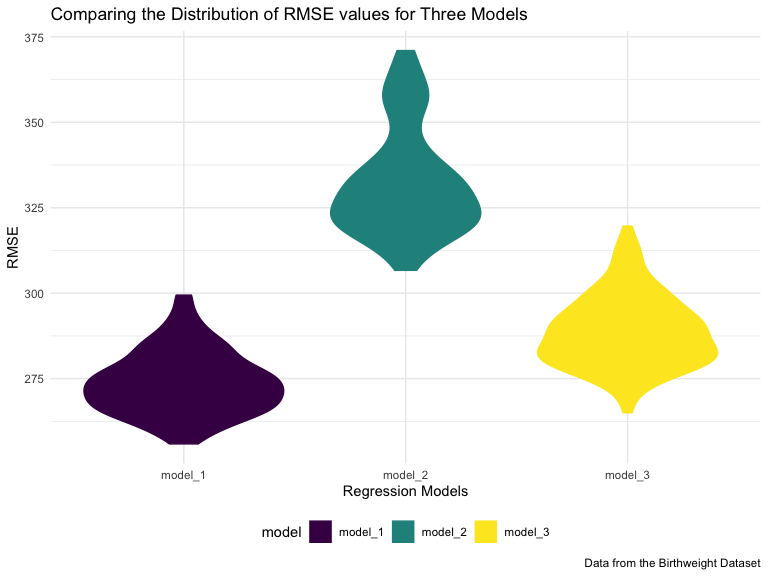
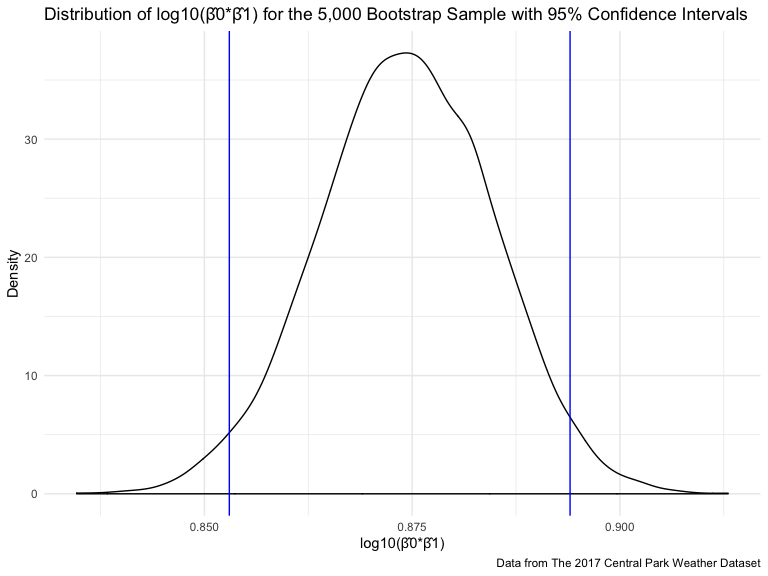

Homework 6
================
Kodiak Soled
11/19/2019

``` r
library(tidyverse) 
library(viridis)
library(modelr)
library(mgcv)

knitr::opts_chunk$set(
    echo = TRUE,
    warning = FALSE,
    fig.width = 8, 
  fig.height = 6,
  out.width = "90%"
)

options(
  ggplot2.continuous.colour = "viridis",
  ggplot2.continuous.fill = "viridis"
)

scale_colour_discrete = scale_colour_viridis_d

scale_fill_discrete = scale_fill_viridis_d

theme_set(theme_minimal() + theme(legend.position = "bottom"))
```

## Problem 1

#### Data Import & Cleaning

Loading in the Birthweight Dataset and cleaning the data including:

  - reading in the csv file (`read_csv`)
  - cleaning names (`janitor::clean_names`)
  - mutating catagorical variables that are numeric to factor variables
    (`as.factor`)
  - rounding numeric variables to the second decimal place

<!-- end list -->

``` r
birthweight =
  read_csv("./data/birthweight.csv") %>%
  janitor::clean_names() %>%
  mutate(
    babysex = as.factor(babysex),
    frace = as.factor(frace),
    mrace = as.factor(mrace),
    malform = as.factor(malform)
  ) %>%
  mutate_if(is.numeric, round, 2)
```

#### Proposed Model

Creating a proposed regression model using 13 out of the 20 predictors:
babysex, bhead, blength, delwt, fincome, gaweeks, malform, menarche,
mheight, momage, mrace, ppbmi, smoken.

``` r
model_1 = 
  lm(bwt ~ babysex + bhead + blength + delwt + fincome + gaweeks + malform + menarche + mheight + momage + mrace + ppbmi + smoken, data = birthweight) 

model_1 %>% 
  broom::glance() %>%
  knitr::kable(caption = "Regression Model 1 Summary")
```

| r.squared | adj.r.squared |    sigma | statistic | p.value | df |     logLik |      AIC |      BIC |  deviance | df.residual |
| --------: | ------------: | -------: | --------: | ------: | -: | ---------: | -------: | -------: | --------: | ----------: |
| 0.7177418 |     0.7167631 | 272.5685 |  733.3594 |       0 | 16 | \-30502.47 | 61038.95 | 61147.34 | 321393955 |        4326 |

Regression Model 1 Summary

*Process of Modeling*

I used a data-driven model-building process of stepwise deletion to come
up with my proposed regression model. To do this, I first included every
predictor in the model. Then, one by one , I deleted each predictor from
the model and evaluated its effect on the AIC: if deleting the predictor
raised the AIC I kept it in the model, and if deleting the predictor
lowered the AIC I took it out of the model. The resulting model includes
the only the predictors that resulted in the lowest AIC.

#### Plotting Residuals vs. Fitted Values

Creating a scatterplot (`geom_point`) of the proposed regression model’s
residuals against its fitted (predicted) values using the
`add_residuals` and `add_predictions` functions from the `modelr`
package, then drawing a linear regression line through the plot using
`geom_smooth`.

``` r
birthweight %>% 
  modelr::add_residuals(model_1) %>% 
  modelr::add_predictions(model_1) %>%
  ggplot(aes(x = pred, y = resid)) + 
  geom_point() +
  geom_smooth(se = FALSE, method = "lm", color = "blue") +
  labs(
    title = "Plot of Model Residuals against Fitted Values",
    x = "Fitted Values", 
    y = "Residuals"
  )
```


#### Comparing Models

Creating linear models for the two other models in the homework
instructions in order to compare them to my proposed model.

``` r
model_2 = lm(bwt ~ blength + gaweeks, data = birthweight)

model_2 %>% 
  broom::glance()  %>%
  knitr::kable(caption = "Regression Model 2 Summary")
```

| r.squared | adj.r.squared |    sigma | statistic | p.value | df |     logLik |      AIC |      BIC |  deviance | df.residual |
| --------: | ------------: | -------: | --------: | ------: | -: | ---------: | -------: | -------: | --------: | ----------: |
| 0.5768894 |     0.5766943 | 333.2174 |  2958.001 |       0 |  3 | \-31381.32 | 62770.64 | 62796.14 | 481775844 |        4339 |

Regression Model 2
Summary

``` r
model_3 = lm(bwt ~ bhead + blength + babysex + bhead * blength + bhead * babysex + blength * babysex + bhead * blength * babysex, data = birthweight)

model_3 %>% 
  broom::glance() %>%
  knitr::kable(caption = "Regression Model 3 Summary")
```

| r.squared | adj.r.squared |    sigma | statistic | p.value | df |    logLik |      AIC |      BIC |  deviance | df.residual |
| --------: | ------------: | -------: | --------: | ------: | -: | --------: | -------: | -------: | --------: | ----------: |
|  0.684876 |      0.684367 | 287.7344 |  1345.616 |       0 |  8 | \-30741.6 | 61501.19 | 61558.58 | 358816655 |        4334 |

Regression Model 3 Summary

Comparing all three models by creating a scatterplot of each model with
indiviudal linear regression lines by:

  - `gathering_prediction` from the three models
  - putting the models in order (`fct_inorder`)
  - `filter`ing out the single outlier that was skewing the regression
    line
  - creating the scatterplots (`geom_point`) with the outcome (“bwt”) on
    the y-axis, and the common predictor (“blength”) on the x-axis, then
    using `facet_wrap` to create the three scatterplots

<!-- end list -->

``` r
birthweight %>% 
  gather_predictions(model_1, model_2, model_3) %>%
  mutate(model = fct_inorder(model)) %>%
  filter(blength > 25) %>% #outlier so didn't include 
  ggplot(aes(x = blength, y = bwt, color = model)) +
  geom_point(alpha = 0.5) +
  geom_smooth(method = "lm", color = "black") +
  facet_wrap(~model) +
  labs(
    title = "Comparing Three Model's Prediction of Birth Weight using Birth Length",
    x = "Birth Length",
    y = "Birth Weight",
    caption = "Data from the Birthweight Dataset"
  )
```


This is not a very useful way to compare the models, so next we can
compare the models using cross-validated prediction error by:

  - creating the training and testing split, multiple times
    (`crossv_mc`)
  - fitting the three models and assessing prediction accuracy by
    obtaining RMSEs using `map` & `map2_dbl` under the `mutate` function

<!-- end list -->

``` r
cv_df = 
  crossv_mc(birthweight, 100) 

cv_df = 
  cv_df %>% 
  mutate(
    fit_model_1  = map(train, ~lm(bwt ~ babysex + bhead + blength + delwt + fincome + gaweeks + malform + menarche + mheight + momage + mrace + ppbmi + smoken, data = .x)),
    fit_model_2  = map(train, ~lm(bwt ~ blength + gaweeks, data = .x)),
    fit_model_3  = map(train, ~lm(bwt ~ bhead + blength + babysex + bhead * blength + bhead * babysex + blength * babysex + bhead * blength * babysex, data = .x))
    ) %>% 
  mutate(
    rmse_model_1 = map2_dbl(fit_model_1, test, ~rmse(model = .x, data = .y)),
    rmse_model_2 = map2_dbl(fit_model_2, test, ~rmse(model = .x, data = .y)),
    rmse_model_3 = map2_dbl(fit_model_3, test, ~rmse(model = .x, data = .y))
    )
```

Now we can show the distribution of RMSE values for each of the three
models.

``` r
cv_df %>%
  select(starts_with("rmse")) %>%
  pivot_longer(
    everything(),
    names_to = "model", 
    values_to = "rmse",
    names_prefix = "rmse_") %>%
  mutate(model = fct_inorder(model)) %>%
  ggplot(aes(x = model, y = rmse)) + 
  geom_violin(aes(fill = model, color = model)) +
  labs(
    title = "Comparing the Distribution of RMSE values for Three Models",
    x = "Regression Models",
    y = "RMSE",
    caption = "Data from the Birthweight Dataset"
  )
```



*Description*

My proposed regression model 1 is the clear winner as it has the lowest
prediction error distribution among the three models.

## Problem 2

#### Data Import & Cleaning

Loading in the The 2017 Central Park Weather Dataset.

``` r
weather_df = 
  rnoaa::meteo_pull_monitors(
    c("USW00094728"),
    var = c("PRCP", "TMIN", "TMAX"), 
    date_min = "2017-01-01",
    date_max = "2017-12-31") %>%
  mutate(
    name = recode(id, USW00094728 = "CentralPark_NY"),
    tmin = tmin / 10,
    tmax = tmax / 10) %>%
  select(name, id, everything())

set.seed(1)
```

#### Identify Quantiles

Identifing the 2.5% and 97.5% quantiles to provide a 95% confidence
interval for β̂0 and β̂ by:

  - using the `bootstrap` function from the `modelr` package to draw
    5,000 bootstrap samples from The 2017 Central Park Weather Dataset
  - created a `map` statement for the linear model and for the
    `broom::tidy` function to get the estimate for β̂0 and β̂
  - `select`ing out the variables of interest (“.id”, “term”, and
    “estimate”)
  - pivoting the table wider in preparation for multiplying β̂0\*β̂
  - cleaning (`janitor::clean_names`) the name of the variables (need it
    for the next line of code)
  - creating a new variable using `mutate` that takes the log of β̂0\*β̂
  - creating the 2.5% and 97.5% `quantile`for log(β̂0\*\*β̂) under the
    `summarize` function
  - putting the confidence interval into a reader-friendly table using
    `knitr::kable`

<!-- end list -->

``` r
conf_interval_log = 
  weather_df %>% 
  modelr::bootstrap(n = 5000) %>% 
  mutate(
    models = map(strap, ~lm(tmax ~ tmin, data = .x)),
    results = map(models, broom::tidy)
    ) %>% 
  select(-strap, -models) %>% 
  unnest(results) %>%
  select(.id, term, estimate) %>%
  pivot_wider(
    names_from = "term",
    values_from = "estimate"
  ) %>%
  janitor::clean_names() %>%
  mutate(
    log_intercept_tmin = log(intercept * tmin)
  )

conf_interval_log %>%  
  summarize(
    lower_CI = quantile(log_intercept_tmin, c(.025)),
    upper_CI = quantile(log_intercept_tmin, c(.975))
  ) %>%
  knitr::kable(caption = "95% Confidence Interval for log(β̂0*β̂1)")
```

| lower\_CI | upper\_CI |
| --------: | --------: |
|  1.964949 |  2.058887 |

95% Confidence Interval for log(β̂0\*β̂1)

Identifing the 2.5% and 97.5% quantiles to provide a 95% confidence
interval for r̂^2 using the same steps as just list (except omiting the
creation of the log(β̂0^β̂) variable and instead calculating the
quantiles for r̂^2).

``` r
conf_interval_r_squared = 
  weather_df %>% 
  modelr::bootstrap(n = 5000) %>% 
  mutate(
    models = map(strap, ~lm(tmax ~ tmin, data = .x)),
    results = map(models, broom::glance)
    ) %>% 
  select(-strap, -models) %>% 
  unnest(results) %>%
  janitor::clean_names()

conf_interval_r_squared %>%
    summarize(
    lower_CI = quantile(r_squared, c(.025)),
    upper_CI = quantile(r_squared, c(.975))
  ) %>%
  knitr::kable(caption = "95% Confidence Interval for r̂^2")
```

| lower\_CI | upper\_CI |
| --------: | --------: |
| 0.8933116 | 0.9272795 |

95% Confidence Interval for r̂^2

#### Plot Distribution of log(β̂0\*β̂1) and r̂^2

Plotting the distribution of log(β̂0\*β̂1) for the 5,000 bootstrap
samples with its associated 95% confidence interval by taking the
“conf\_interval\_log” dataframe created above and the making a density
plot (`geom_density`), incluidng using `geom_vline` to plot the 2.5% and
97.5% quantiles.

``` r
conf_interval_log %>%
  ggplot(aes(x = log_intercept_tmin)) +
  geom_density() +
  geom_vline(xintercept = 1.97, color = "blue") +
  geom_vline(xintercept = 2.06, color = "blue") +
  labs(
    title = "Distribution of log(β̂0*β̂1) for the 5,000 Bootstrap Sample with 95% Confidence Intervals",
    x = "log(β̂0*β̂1)",
    y = "Density",
    caption = "Data from The 2017 Central Park Weather Dataset"
  )
```



Plotting the distribution of r̂^2 for the 5,000 bootstrap samples and
its associated 95% confidence interval using the same steps as above
(except using the “conf\_interval\_r\_squared” dataset and plotting r̂^2
on the x-axis).

``` r
conf_interval_r_squared %>%
  ggplot(aes(x = r_squared)) + 
  geom_density() +
  geom_vline(xintercept = 0.893, color = "blue") +
  geom_vline(xintercept = 0.927, color = "blue") + 
  labs(
    title = "Distribution of r̂^2 for the 5,000 Bootstrap Samples with 95% Confidence Intervals",
    x = "r̂^2)",
    y = "Density",
    caption = "Data from The 2017 Central Park Weather Dataset"
  )
```


*Description*

The two plots both have a fairly symmetrical distributions with a single
peak. The mean of the log(β̂0\*β̂1) distribution centers around 2.01 and
the mean of the r̂^2 distribution centers around 0.91.
